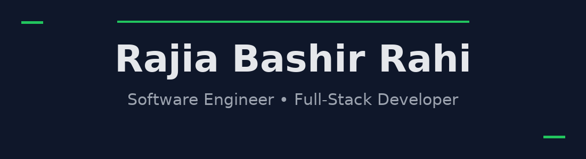

  

 

  <ul align="center">
    

      <h1 style="display: inline-block">Hi, I'm Rajia Bashir Rahi</h1>
    

    
  </ul>

 

- 👋 Hi, I’m **[@RAJIABASHIR](https://github.com/RAJIABASHIR)**
- 💻 I’m a **Computer Engineer & Software Developer** with **full-stack** skills.
- 🖥️ I’m currently working on full-stack web apps using **HTML, CSS, JavaScript, React, Node.js** and **Express**.
- 🎨 I enjoy building **responsive, efficient UIs** with **Tailwind CSS**.
- 📚 I’m learning **TypeScript, Next.js, and modern frontend architecture**.
- 💬 Ask me about **Full-Stack Development (React, Node, Express, MongoDB)**.  
- 📫 Feel free to reach me at **[Email](rajiabashirrahi@gmail.com)**

 

## <b> FOLLOW ME ON SOCIALS:</b>

  

    
    
  

 

## <b> TECHNOLOGY STACK:</b>

### Languages

### CSS Frameworks & Libraries

### JavaScript Frameworks & Libraries

### Database & Model

### Deployment Platforms

### Design & Graphics

### Tools & Technologies

 

## <b> GITHUB STATS:</b>

  

  

  

 

## Highlighted Projects

- **moviemaster-pro** – Movie management & discovery web app for browsing, adding, and updating movies. Full-stack task manager with separate client & server
  
  Live Link - https://moviemaster-pro-client.netlify.app
  
  Github link : https://github.com/RAJIABASHIR/moviemaster-pro
  
- **hero-apps** – App showcase / landing page that highlights multiple apps in a clean, modern UI.

  Github Link : https://github.com/RAJIABASHIR/hero-apps

  Live Link : https://productive-hero-apps.netlify.app/
  
- **winter-pet-care** – Informative, responsive page focused on keeping pets safe and comfortable in winter.

  Github link - https://github.com/programming-hero-web-course2/b12-a9-firesheild-RAJIABASHIR

  live link - https://pet-care-in-winter.netlify.app

